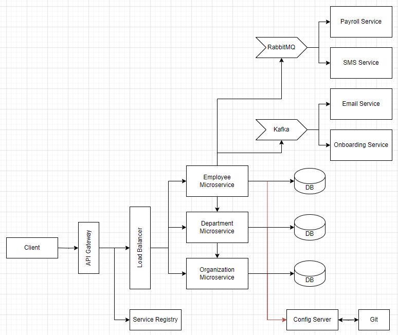

# HR Management Backend # 

Employee administration backend system using Java Spring Boot.

Concepts
* Java
* MySQL
* Spring Boot
* Spring Cloud
  * Service Registry
  * API Gateway
  * Config Server
  * Distributed Tracing
  * [Circuit Breaker](https://medium.com/javarevisited/what-is-circuit-breaker-in-microservices-a94f95f5e5ae)
* RabbitMQ
* Kafka
* Docker

## Getting Started

### Prerequisites

Install Tools
- [IntelliJ IDEA](https://www.jetbrains.com/idea/download/?section=windows)
- [Java](https://www.oracle.com/java/technologies/downloads/)
- [Docker desktop](https://www.docker.com/products/docker-desktop)
- [Postman](https://www.postman.com/downloads/)

Create project using [Spring Boot](https://start.spring.io/)

### Setup

1. Clone the repo
   ```
   git clone https://github.com/xiao-yangg/workhub-microservices.git
   ```
2. Open using IntelliJ IDEA
3. Run microservices in order:
   ```
   1. Service Registry, Config Server
   2. API Gateway
   3. Organization Service
   4. Department Service
   5. Employee Service
   6. Email Service, Onboarding Service, Payroll Service, SMS Service
   ```
4. Test with Postman / any frontend

## Diagram



## Acknowledgement
https://www.udemy.com/course/building-microservices-with-spring-boot-and-spring-cloud/
